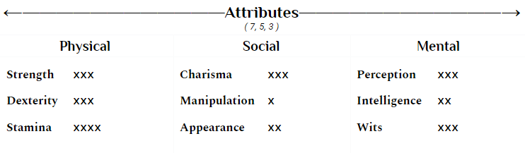
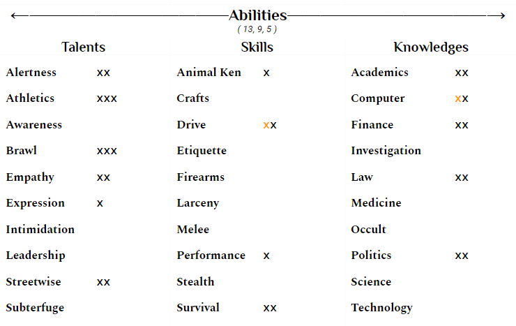
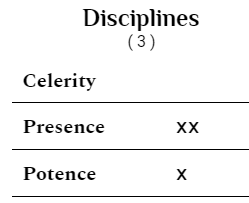

  

      New Player Guide
  

<b>Important</b>

The information below walks you through creating your first Vampire: the Masquerade character, whether Kindred or mortal, for the specific LA in Anarchy setting. If you are not completely brand new to V20, please refer to our standard character creation page instead, as these rules are different to help introduce new players to Vampire.

Welcome to Vampire

Welcome to Vampire: the Masquerade! We’re thrilled your first attempt at playing Vampire is here with us at LA in Anarchy. Our goal with this guide is to make the process of constructing your first character as easy and painless as possible.

Materials

This is what you'll need to make your first character. To use the character sheets, please select file > make a copy and save it into your drive. You're welcome to download it and use it as a Word document instead, but it isn't preferred, as we'll still need a google share link to it.

<b class="thirdHeader">Books</b>
* <a href="http://bit.ly/V20-Core">Core Rulebook</a>
* <a href="http://bit.ly/V20-Clans">Lore of the Clans</a>

<b class="thirdHeader">Character Sheets</b>
* <a href="http://bit.ly/V20-Vampire-Sheet">Vampire</a>
* <a href="http://bit.ly/V20-Human-Sheet">Human</a>

Mature Content Warning

While it's anticipated that a game centered around vampires wouldn't be for the feint of heart, I'd still advise you read the official warning released by White Wolf before continuing.

<em>"For the past several decades, Vampire: The Masquerade has addressed the darkness in the real world through horror stories: it has talked about AIDS, capitalist exploitation, sexual predation, the resurgence of far-right political extremism, religious fanaticism, state and private surveillance, and many other issues. This version of the game does not shy away from any of the above, and we believe exploration of subjects like these is as valid in roleplaying games as it is in other media. Including a problematic subject in a Storytelling game is not the same as glorifying it, and if you take the chance to explore it critically, it can be the exact opposite. If we understand the problems facing us, we are better armed to fight them.

[This game] includes in-world references and expressions of the following: sexual violence, political extremism, physical violence and gore, mind control, torture, abuse, imprisonment and kidnapping, racism, sexism, and homophobia, to name a few. It’s a game about monsters.

“Why are you telling me this?” you might be saying.

Someone at your table is not familiar with this game. Someone at your table has dealt with some of these issues in real life. Someone at your table wants to know that you read this warning and know you will be considerate to them as players, while putting their character through the wringer.

This is a game about monsters. But it is only a game.

Don’t use it as an excuse to be a monster yourself."</em>

~ V5, White Wolf Entertainment

Which to Play: Human or Vampire?

You are able to choose whether you would like to play as a human or vampire initially. This guide covers both, as they both have their own pros and cons, so feel free to play whichever you prefer.

* <b>Humans:</b> They are easier to create, as all you would be doing is making a normal person to put into play. While you won't be able to get behind the masquerade immediately, they have the benefit of learning in-character as you do out, and play through the embrace should you decide later on. Mechanically, less is open at this time but would become available once they become Kindred or are ghouled.
  * <em><b>TL;DR -</b> If you want to ease into things, this is the best option.</em>
* <b>Vampires:</b> It will take a little more consideration to create a vampire, but doing so leaves you various plot threads to expand as you see fit now or later on, such as the state of their mortal family and sire. They still have the opportunity to be in the dark about their existence, but the initial shock of behind dragged behind the curtain has passed. In return, more would be available immediately in a narrative and mechanical sense, but this also means there is more to learn out-of-character to compensate.
  * <em><b>TL;DR -</b> Only choose to begin with a vampire if you don't mind jumping right off into the deep-end.</em>

 

Getting Started

Making a Human Concept

Whether or not you decide on making a human or vampire is currently irrelevant as both of them start in the same place: mortal. Consider the following questions to get you started:

* Place of birth, where do they live today, where have they lived and why?
* Do they have living family? Are they close to them? Why?
* Are they religious? What religion? How religious? (mass on Sundays, pray every meal, tithe regularly and donate time, etc.)
* What is their place in the world from your character's point of view? Where would you like it to be?
* What little things are important to them?
* What weighs heavy on their soul? What sins have they committed, or if they don't believe in such things, why?
* What habits do they have? Not just smoking, drinking, but also do they read the paper every morning, have a routine, etc.?
* What matters to them?

This might seem like a lot, so take your time! Our goal is to create people, not character sheets. With that in mind, try and keep the person more average than not, as playing a super famous celebrity or the best mathematician of the 21st century has the potential to overshadow others playing in the setting.

Archetype

<em>Everyone plays a role, often several, every day. Every individual displays multiple layers of personality, varying from the contrived to the sincere. Each of these roles defines how we interact with the people and places around us, and we choose which parts of ourselves we wish to show.

It is the same with Kindred. The concept of Nature and Demeanor corresponds directly to the different masks we wear when we interact. A Vampire character’s Nature is her true self, her innermost being — the person she truly is. It is dangerous to show this, though, as it lets others know who we are and what is important to us. Thus, characters also have Demeanors, faces they show to the world. By choosing how we relate to the world, we are able to choose how it relates to us as well, as we guide the responses others give us.

Philosophy aside, personality also has an effect on the mechanics of Vampire. A character may regain her drive and sense of purpose by acting in accordance with her Nature. Every time a character fulfills the requirement of her Nature Archetype (see below), that character has the opportunity to regain a point of spent Willpower (see p. 267). If the Storyteller allows, the character regains the point.

Archetypes allow players to build a sense of personality for their characters, and to define a bit of what makes the character tick. It is worth noting that Archetypes are not rigid; characters need not slavishly devote themselves to their Natures and Demeanors. Rather, the character should act as the player reasonably or emotionally believes she would act in a given situation.</em>

~ V20, 87-88

Each character has two archetypes, their Nature and their Demeanor. This is where you should begin to consider your character's personality. Their Nature reflects who they truly are, while their Demeanor is how they act in public. They should not be the same, as everyone wears a mask to some degree or another.

If you have absolutely no idea where to begin, try to take this <a href="http://www.humanmetrics.com/cgi-win/jtypes2.asp">personality test</a> from their perspective. Don’t just make a perfect representation of the result, however. Instead use it as a base to modify and build from!

You can find a full list of the archetypes you’re able to pick from here.

 

 

 Traits
 

Attributes

This is where you’re going to begin the actual mechanical aspect of your character. Unlike in other TTRPGs, you aren’t going to be rolling dice at all during this process. Instead, you have a number of dots to assign depending on if you’re playing a human or vampire.

* <b>Vampires:</b> 7 in Primary, 5 in Secondary, 3 in Tertiary
* <b>Human:</b> 6 in Primary, 4 in Secondary, 3 in Tertiary

First, prioritize the three different categories. If your character is more smart than social, they would be a mental primary. If they are really athletic and not that good with people, they would be a physical primary.

Once you do this, now we assign the dots within the category!

<b>Example (Click me!)</b>

For example, let’s say we’re making a Boxer who had just gotten embraced. He would use the Vampire attribute dots, and be a physical primary due to his occupation. I decided to make him a mental secondary since he needs to be quick on his feet and is good at momentary problem solving, and social tertiary because his social skills are overall about average. This is how it might look on a sheet:

</img>

* <b>Physical:</b> I chose Stamina first because he is rather resilient after boxing for so many years, he’s able to take more hits than the average person and stay on his feet for long periods of time. Dexterity and Strength were set equal, since it's hard to be in his profession without picking up both speed/coordination and a bit more muscle than average.
* <b>Social:</b> He’s a people person, which is why Charisma was chosen first. He’s extroverted and likes to talk, which is how he got his foot in the door with his coach who didn’t think he was anything special at first. Because he likes to make more friends than enemies, lying or cheating isn’t his strong suit, leaving Manipulation alone. Appearance was brought up because he looks average, not ugly.
* <b>Mental:</b> He’s always been quick on his feet, and this doesn’t just relate to boxing. Even if he isn’t the smartest person in the room, he’s usually one of the first to offer a solution to a problem or crack a joke. Wits was chosen, with Perception following because he is pretty good at spotting small details, whether it’s the favorite food of a new friend or a shift in his opponent's gait. A dot was saved for Intelligence because he’s average in the classroom, but nowhere near being a genius.

<b>Important</b>

Each attribute will have 1 dot in each. These don't count towards the totals you're distributing.

Anything at 4 dots should be well reasoned, like I did above, as they should be using that trait <b><em>constantly</em></b>. Nothing can be at five dots for right now, we’ll get there eventually!

Abilities

Now we’ve reached the real mechanical meat of the character: the individual things that the character can do. There are 30 of them, which might make it seem overwhelming, but it won’t be as painful as it might seem!

Just like before, Vampires and Humans have different numbers of dots they can assign in the different categories:

* <b>Vampires:</b> 13 in Primary, 9 in Secondary, 5 in Tertiary
* <b>Human:</b> 11 in Primary, 7 in Secondary, 4 in Tertiary

Before we start assigning them, take a free dot in both drive and computers. Vampire is a little dated, so you need the first dot in drive to drive a car and the first dot in computers to use a touch screen. Unless there’s a specific reason why your character wouldn’t be able to do either of those things, add those dots now. They don’t count against your totals.

Once again need to prioritize the categories. If someone spent a lot of time in school, they’re likely a Knowledge Primary, while someone really good with technical things might be a Skills Primary. It’s highly encouraged to take a look at what each dot means before assigning them, as they might be different than what you believe. That can be done here.

<b>Important</b>

Nothing at this stage can be at 4 dots or higher. This is a standard character creation rule, not a house rule. If you have dots that are at 4 or 5 at this point, please place them elsewhere.

<b>Example (Click me!)</b>

For our boxer, I made him a Talents Primary because of his athletics, a Knowledges Secondary because of his schooling and hobbies, and a Skills Tertiary because there aren’t a lot of technical things he’s good at. The breakdown looks like this:

</img>

* <b>Talents:</b> His <b>Alertness</b> comes from how perceptive he is. The <b>Athletics</b> and <b>Brawl</b> come from his occupation and how he is constantly training. Past that, things need to get a little more specific as to how he has this traits. So, <b>Empathy</b> comes from how extroverted and social he is, always wanting to be around others. Because he's always around others and speaking his mind, he's able to articulate himself well which is why he has a dot of <b>Expression</b>. His <b>Leadership</b> is from coaching others when they look to him for help in the gym, as he's always willing to lend a hand. Finally, the <b>Streetwise</b> is because he grew up in a rough part of town, so he had to learn his way around a city at a young age to stay safe.
* <b>Social:</b> He has the first dot of <b>Animal Ken</b> because he loves animals and has owned a few pets, even if they weren’t the most well trained, and can be found watching animal shows on TV when he has free time. While he got the first dot of <b>Drive</b> for free, he has the second because the car he drives is an old and beat up with a manual transmission. Even though he could afford something nicer, he wants to stick with what he has, since his Dad bought him the car a gift before he passed away. The <b>Survival</b> comes from having been in boy scouts since he was old enough to join all the way through high school, and his <b>Performance</b> is from an embarrassing tenancy to towards drunk karaoke.
* <b>Mental:</b> Our boxer did go to college, but he wasn't sure what he wanted to do. He spent his time hopping from pre-law, to business, and ultimately settled on political science as his major. It did take him an extra year to graduate due to his indecisiveness, but he learned a lot from the classes he did take. <b>Academics</b> comes from the American history classes he took, specifically fascinated with the colonial period. <b>Computers</b> is because of how much of his free time, as little as it might be, he spends online. Doing his own taxes and budgeting, keeping up with the news, and being an active participant in his local political scene is what keeps his <b>Finance</b>, <b>Law</b>, and <b>Politics</b> up, as he knows more than the average person.

Anything at 3 dots should be something they are doing all the time. Our boxer can have 3 dots in Brawl because he’s in the ring for a living, but having 3 dots in Larceny when he doesn’t know how to pick a lock or case a building wouldn’t make sense.

  
 

    

      

        Clan
      

      Now that we have a rough outline of a character, we can now consider what clan they are going to be. If you’re making a human, you can skip this step! They are broken down like this:

* <b>Difficulty:</b> How easy the clan is to portray, both narratively and mechanically managing their weakness
* <b>Disciplines:</b> The supernatural powers the clan has innate access to. This should not have a big impact on your decision!
* <b>Weakness:</b> The weakness that ties them to their clan

The clans that you have access to, being a new player, are as follows:

Brujah

<em>"I’ll give you a head start. You’re the tortoise and I’m the hare — a pissed-off, fuck-the-world hare with a score to settle and a thirst like the devil’s own."</em>

Brujah still feel the flames of the passions that once inspired them as mortals. Clan Brujah loves a cause and is quick to act on a stirring speech, accusation of injustice, or a call to arms. This connection to passion can be a blessing, but inspiration can also yield to the madness and hunger of the Beast. While commonly drawn to mortals with violent or ungovernable personalities that share similar outlook or enthusiasm for a cause as the prospective sire, they often Embrace without really thinking much about it, and their childer are from anywhere and everywhere one can think.

* <b>Difficulty:</b> Easy
* <b>Disciplines:</b> Celerity, Potence, Presence
* <b>Weakness:</b> The difficulties of rolls to resist or guide frenzy are two higher than normal. Additionally, a Brujah may never spend Willpower to avoid frenzy, though they may spend a point of Willpower to end a frenzy that has already begun.

Toreador

<em>"Long after you die, I will still be young, beautiful, and adored by everyone whose life I touch."</em>

The Kindred of Clan Toreador often involve themselves greatly in the world of mortals. They have any number of reasons, whether enjoying proximity to the blush of life, cultivating veritable cults of doting followers, or influencing and following the trends that their own kind simultaneously mock and venerate. To hear the Toreador tell it, they are the Muses of a desperate mortal world, inspiring through their beauty or patronage. Because of this, many Toreador hail from high-society or “bohemian” backgrounds. Indeed, many are themselves artists or influential among local art scenes or other subcultures. Actors, singers, musicians, sculptors, poets, playwrights, authors, and creative folk of any stripe may well find a home in the Clan.

* <b>Difficulty:</b> Easy
* <b>Disciplines:</b>  Auspex, Celerity, Presence
* <b>Weakness:</b> When a Toreador experiences something truly remarkable — a person, an objet d’art, a lovely sunrise — the player must make a Self-Control or Instincts roll (difficulty 6). Failure means that the Kindred finds herself enthralled by the experience. The dazzled Toreador cannot act for the duration of the scene aside from commenting on or continuing their involvement with whatever has captured their attention. If the experience no longer affects her (whether by moving, being destroyed, or whatever is appropriate to the situation), the captivation ends. Enraptured Toreador may not even defend themselves if attacked, though being wounded allows them to make another Self-Control or Instincts roll.

Gangrel

<em>"This is not a place for you, and it is too late to turn back. <b>Run</b>, little man."</em>

More than any other Clan, the Gangrel resemble the beasts associated with the legends of vampires: bats, wolves, and other creatures of darkness. Many shun the elaborate social constructs of both Kindred and kine, preferring to move alone or as a member of small coteries. As a Clan, the Gangrel are wary and aloof. Most would prefer to spend their nights stalking prey or wilding on the rooftops than minding Princely edicts or lobbying for recognition of domain. Gangrel sire childer like they seek prey: after long hunts during which the prospective childe doesn’t even know they're being followed. Creating a fledgling means sharing limited resources, so each sire childe relationship is unique and significant. Outlanders Embrace because they choose an individual, not out of whim or recklessness. Those who earn their attention are hardy, whether physically or emotionally.

* <b>Difficulty:</b> Moderate
* <b>Disciplines:</b> Animalism, Fortitude, Protean
* <b>Weakness:</b> Every time a Gangrel frenzies, they acquire a temporary animal characteristic (which may replace an existing temporary one). Players should work with the Storyteller to determine what new animal trait is acquired (whether the frenzy involved the fight-or-flight impulse may be relevant). Over time, or in an exceptional situation, a particular animal feature may become permanent, with the next frenzy adding a new feature. A good guideline is to require each frenzy-gained trait to have some effect grounded in system terms (such as the temporary reduction of Social Attribute dots or a permanent loss of Humanity), though Storytellers may allow narrative-only traits that can shape the story

Nosferatu

<em>"Nobody down here but us boogeymen. Hey, whose head is this?"</em>

Twisted by the mark of Caine, members of Clan Nosferatu are warped by the Embrace into hideous monsters. As such, they skulk and keep to the shadows, and they often rouse the ire and mockery of other Kindred for their nightmarish appearances. Still others are so terrified or revolted by the Nosferatu that these warped Kindred have little social interaction at all. Because of this, some Nosferatu Embrace the damaged, flawed, outcast, or vile, feeling some degree of kinship with them. Other Embrace spitefully, dragging the beautiful or privileged into an immortal hell of disfigurement and monstrosity.

* <b>Difficulty:</b> Hard
* <b>Disciplines:</b> Animalism, Obfuscate, Potence
* <b>Weakness:</b> All Nosferatu have an Appearance score of zero, and they may never improve it. Cross it off the character sheet. Dice pools that use the Appearance Trait are inherently difficult for these hideous Kindred.

Ventrue

<em>"There is no shame to bending the knee to one such as myself, so pay your fucking tribute before I lose my temper."</em>

Throughout history, while the other Clans have skulked about their petty intrigues, the Ventrue have curried favor with Caesar, whispered into the ear of Charlemagne, bankrolled the Age of Exploration, and even swayed policy in the Holy See. Theirs is a legacy of rulership, from Ventrue fledglings starting their climb to the top to the mightiest elders whose influence spans the world. Long have they played kingmaker in the shadows in the mortal world, and long have they been the Clan of Kings among the Kindred. Anyone who has “made something of herself” may attract the attention of the Ventrue, who judge their childer based on their prominence and success even before they start to groom them for the Embrace. Socialites, moneyed family, corporate wunderkinds, military leaders, and even untested newcomers who show great promise are keenly valued among the Blue Bloods.

* <b>Difficulty:</b> Hard
* <b>Disciplines:</b> Dominate, Fortitude, Presence
* <b>Weakness:</b> The Ventrue have rarified tastes, and they find only one specific type of mortal blood palatable and vital for them. When a player creates a Ventrue character, he should decide with the Storyteller what specific type of blood suits the character, and this choice is permanent. Blood of other types (even animals) simply offers the vampire no blood pool increase, no matter how much he consumes — he simply vomits it back up. This refined palate may be very narrow or very broad — say, the blood of younger sisters, or the blood of nude children. Vampiric blood is exempt from this restriction.

Once you decide on a clan, make sure to read their entry in the core rulebook, and then their section in Lore of the Clans. This should give you a great idea of the clan you are going to portray.

Sire

I decided our boxer was Embraced by a Brujah. But, someone doesn’t just spontaneously become a Brujah, they had to be turned into one by another vampire. This is called the Embrace.

The process is simple: the childer-to-be is killed by their Sire, the vampire turning them, and then fed some of their blood. This immediately awakens the childe into their first hunger frenzy where they’ll attack the closest blood container to them, whether that’s their Sire, prey their sire provided, or an unfortunate passerby.

It’s important to really consider <em>why</em> your character was embraced by their Sire. Did a Toreador find their art utterly captivating, to the point where they had to eternalize the artist? Did a Gangrel stalk them along nightly treks in the woods, drawn to their resilience?

Once you create a rough outline of who their sire is, you need to decide their generation, as your character’s generation will be one step higher than theirs. Commonly, older vampires are of lower generations. The lowest generation the sire of a new player can be is 9 for the purpose of keeping things simple. Once you decide, add it to the top bar. Then fill out their blood pool maximum and blood pool per turn from the chart below.

<table style= "color:#384b7e; margin-bottom: -20px;">
<thead>
  <tr>
    <th class="white">Generation</th>
    <th class="white">Blood Pool Max</th>
    <th class="white">Blood Per Turn</th>
  </tr>
</thead>
<tbody>
  <tr>
    <td>Tenth</td>
    <td>13</td>
    <td>1</td>
  </tr>
  <tr style="background: white; color:#384b7e;">
    <td>Eleventh</td>
    <td>12</td>
    <td>1</td>
  </tr>
  <tr>
    <td>Twelfth</td>
    <td>11</td>
    <td>1</td>
  </tr>
  <tr>
    <td>Thirteenth</td>
    <td>10</td>
    <td>1</td>
  </tr>
</tbody>
</table>

<b>Example (Click me!)</b>

For our boxer, let’s say his Sire had been boxing in his prime, but an injury left him unable to continue at a young age. He attended the same gym as our boxer every night, slowly growing more impressed with not only his skill in the ring, but also his passion for others. After growing to be decent friends over the nights they were able to meet, he was embraced after accepting a job offer from him.

Disciplines

Each vampire starts with the three disciplines that are innate to their clan, which are listed above. You get three dots to distribute however you like, whether that’s three all in one, one in each, and so on.

<b>Example (Click me!)</b>

Our boxer’s look like this:

</img>

I gave him Presence 2 because of his social aptitude, and Potence 1 because of his fighting strength.

For a quick reference, here’s a basic summary of what they do before you decide:

<b>Disciplines</b>

Animalism

The Beast resides within all creatures, from scuttling cockroaches to scabrous rats up through untamed wolves and even powerful Kindred elders. Animalism allows the vampire to amplify his intensely primordial nature. He can not only communicate with animals, but can also force his will upon them, directing such beasts to do as he commands. As the vampire grows in power, he can even control the Beast within mortals and other supernaturals.

Beasts grow distinctly agitated in the presence of a vampire who lacks this Discipline or the Skill of Animal Ken, often to the point of attacking or running from the vampire. In contrast, vampires possessing Animalism exude a dominant vibe to lower creatures, which attracts them.

Animalism is commonly found with vampires of the Gangrel and Nosferatu Clans. Manipulation and Charisma are important for the use of Animalism powers; the stronger the vampire’s personality, the more influence he has over animals.

Auspex

Auspex gives the vampire uncanny sensory abilities. She starts with the capacity to heighten her natural senses significantly, but as she grows in power, she can perceive psychic auras and read the thoughts of another being. Auspex can also pierce through mental illusions such as those created by Obfuscate.

However, a vampire with Auspex needs to be careful. Her increased sensory sensitivity can cause her to be drawn in by beautiful things or stunned by loud noises or pungent smells. Sudden or dynamic events can disorient an Auspex-using character unless her player makes a Willpower roll to block them out (difficulty of at least 4, although the more potent the source of distraction, the higher the difficulty). Failure overwhelms the character’s senses, making her oblivious to her surroundings for a turn or two. While the Malkavians and Toreador are more prone to these kinds of distractions, the Tremere and Tzimisce aren’t immune.

Dots in Perception are very useful for using Auspex powers, as more successes help the character gain more sensory information.

Celerity

Not all vampires are slow, meticulous creatures. When needed, some vampires can move fast — really fast. Celerity allows Assamites, Brujah, and Toreadors to move with astonishing swiftness, becoming practically a blur. The Assamites use their speed in conjunction with stealth to strike quickly and viciously from the shadows before they are noticed. Brujah, on the other hand, simply like the edge that the power gives them against overwhelming odds. The Toreador are more inclined to use Celerity to provide an air of unnatural grace to live performances or for an extra push to complete a masterpiece on time, but they can be as quick to draw blood as any assassin or punk when angered.

Dominate

Dominate is one of the most dreaded of Disciplines. It is a vampire’s ability to influence another person’s thoughts and actions through her own force of will. Dominate requires that the vampire capture her victim’s gaze (see p. 152); as such, it may be used against only one subject at a time. Further, commands must be issued verbally, although simple orders may be made with signs — for example, a pointed finger and forceful expression to indicate “Go!” However, the subject won’t comply if he can’t understand the vampire, no matter how powerful the Kindred’s will is.

Perhaps unsurprisingly, vampires to which Dominate comes naturally tend to be from willful, domineering Clans. The Giovanni, Lasombra, Tremere, and Ventrue all consider an iron will to be a boon, and are eager to impose that iron will on any who would move against them.

Fortitude

Although all vampires have an unnatural constitution that make them much sturdier than mortals, Fortitude bestows a resilience that would make an action movie hero envious. Vampires with this Discipline can shrug off agonizing trauma and make the most bone-shattering impact look like a flesh wound. The power even offers protection against the traditional banes of vampires, such as sunlight and fire, and the Gangrel, Ravnos, and Ventrue all find that edge incredibly useful.

Obfuscate

Obfuscate is the uncanny ability for Kindred to conceal themselves from sight, sometimes even in full view of a crowd. An Obfuscated vampire doesn’t actually become invisible, however — rather, he is able to delude observers into believing that he has vanished. Obfuscate also allows Kindred to change their features and conceal other people or objects. Typically vampires using Obfuscate must be within a short range of their witnesses (approximately five yards or meters per dot of Wits + Stealth) for their power to be effective.

Unless the Kindred chooses to make herself seen, she can remain obscured for as long as she wills it. At higher levels, the vampire can actually fade from sight so subtly that those nearby can’t actually recall the moment at which she left.

Usually, few mortals or supernaturals (even those trained in Awareness) can pierce through the fog of Obfuscate. Animals, who rely more on their instincts than their normal senses, can sometime perceive (and be frightened by) the vampire’s presence. Children and those to whom deception is foreign may also be able to pierce the illusion, at the Storyteller’s discretion. Finally, the Auspex Discipline enables Kindred to see through Obfuscate. Even that is not guaranteed, however; refer to “Seeing the Unseen,” p. 142, for more details. (Storytellers needing a die roll for animals or children can use this quick and dirty guideline: treat them as if they had Auspex 1 in terms of contesting Obfuscate. They do not have the Auspex 1 power, but are considered to have it when determining whether a vampire is noticed.)

Since Obfuscate clouds the mind of the viewer, vampires can’t use it to hide their presence from electronic or mechanical devices. Video and photo cameras, for example, capture the vampire’s image accurately. Even so, the person using, say, her cell phone to record an Obfuscated vampire will still have her mind impacted by the power, and she won’t see the Kindred’s image until she views the video at a later date (if even then).

Several Clans cultivate this power — the Assamites, Followers of Set, and Malkavians, for example — but the Nosferatu are particularly known for this Discipline. Some elder Kindred believe that Caine, or perhaps Lilith, bestowed the Clan with this Discipline to compensate for the hideous physical deformities its members suffer.

Most Obfuscate powers last for a scene, or until the vampire ceases maintaining them. Once evoked, they require very little mental effort to keep in place.

Potence

Kindred endowed with Potence possess unnatural strength. This Discipline enables vampire to leap massive distances, lift tremendous weights, and strike opponents with brutal force. Even low ranks of this power can give Kindred physical power beyond mortal bounds. More powerful Kindred can leap so far that they appear to be flying, toss cars like soda cans, and punch through walls like cardboard. While the more subtle mental Disciplines can be awe-inspiring, the brutal effectiveness of Potence is formidable in its own right.

The Brujah, Giovanni, Lasombra, and Nosferatu are naturally gifted with this Discipline, but members of other Clans often make a point to find someone who can teach them the awesome power of Potence.

Presence

Presence is the Discipline of emotional manipulation. Vampires with this power can inspire passionate fervor or unreasoning terror in mortals and Kindred alike. In addition, unlike most Disciplines, some of Presence’s powers can be used on entire crowds at one time. Presence can transcend race, religion, gender, class, and (most importantly) supernatural nature. As such, this subtle power is one of the most useful Disciplines a vampire can possess.

Anyone can resist Presence for one scene by spending a Willpower point and succeeding on a Willpower roll (difficulty 8), but the affected individual must keep spending points until he is no longer in the presence of the vampire (or, in the case of Summon, until the effect wears off). Vampires three or more Generations lower than the wielder need only spend a single Willpower to ignore the Presence for an entire night and need not roll Willpower to do so.

The major drawback of Presence is that it controls only the emotions. It causes others to feel a certain way toward the vampire, but does not give her outright control over them. While people weigh strongly the orders that the vampire declares, their minds are still their own. Suicidal or ridiculous directives don’t sound any more sensible just because the person giving them is unusually fascinating. Still, inspired eloquence or significant wealth used in combination with this Discipline can enable the vampire to urge others along a desired course.

The Brujah, Followers of Set, Toreador, and Ventrue Clans are all adept in this Discipline. The Ventrue are arguably the most skilled with its application, however, due to their ability to use Presence and Dominate in efficient combination.

Protean

Protean allows the Kindred the mystical ability to manipulate his physical form. Some vampires believe the power stems from a heightened connection to the natural world, while others consider it to be a magnification of the mark of Caine. Whatever its basis may be, those that develop this Discipline can grow bestial claws, take on the forms of bats and wolves, turn themselves into mist, and even meld into the very earth itself.

Transformed Kindred can generally use other Disciplines — vampires in wolf form can still read auras and communicate with other animals, for example. However, the Storyteller may rule that certain Disciplines may not be used in specific situations. The Kindred’s clothes and personal possessions also change when he transforms (presumably absorbed within his very substance), although armor and the like do not provide any benefit while transformed.

Vampires cannot change or transform large objects or other beings; Protean is a personal expression of power. A Kindred who has been staked (thereby trapping his soul within his body) cannot transform. Some vampires believe that those who have mastered the highest levels of Protean can deny this limitation, however.

The Gangrel Clan is well known for their mastery of Protean, although other Kindred have learned some of this Discipline’s secrets from these bestial Cainites.

 

 

 Backgrounds
 

Backgrounds are the other “things” your character has that needs to be represented mechanically, but doesn’t/can’t have an associated XP cost. That being said, backgrounds can’t be increased with experience points and must be earned throughout roleplay.
