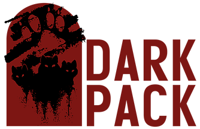

<head>
  <title>LAiA - Setting</title>
  <meta name="description" content="LA in Anarchy's Roleplay Setting Overview.">
</head>

  

      Setting
  

  

  

  Foreward
  

  LA in Anarchy is set in 2026 Los Angeles, though with days advancing as close to real time as possible. Because of this, we are both moving away from the metaplot detailed in <a href="https://whitewolf.fandom.com/wiki/Los_Angeles_by_Night">Los Angeles by Night (1994)</a> and <a href="https://whitewolf.fandom.com/wiki/Vampire:_The_Masquerade_5th_Edition">Vampire: the Masquerade 5th Edition (2018)</a> to create an experience unique to our setting.

  It's important to note that we consider our setting to be in Modern Nights as opposed to Final Nights. Aside from the Week of Nightmares, no other Final Nights events (wars, political changes, etc) are recognized. However, this is from a meta point of view, and characters are able to believe the end-times are upon them if they wish.

  Below is the timeline of events. This is a build up of important happenings since 2018, so please take a moment to read through before making your character.

  

  Pre-chronicle Events
  

  

  Week of Nightmares
  

  The only canon event we recognize as happening before the start date of our chronicle (08/03/2018) is the <a href="https://whitewolf.fandom.com/wiki/Week_of_Nightmares">Week of Nightmares</a>. It lasted from Monday, June 28 to Sunday, July 4, 1999 when the assumed Ravnos Antediluvian Zapathasura woke in India. The majority of its effects were covered by the efforts of both the Camarilla and (primarily) the Technocracy, with the only remnants being the impact it had on the Ravnos as a clan. If you aren't sure what this is, and don't plan on playing a Ravnos, then it likely isn't important to dwell on.

  

  Barony of Angels
  

  At this time, the current Baron of the bulk of the city is a Brujah named Garret Baldwin. He took control in 2010 after his sire decided to retire, leaving the territory up for grabs between him and his brother, Barret Chance. Baron Baldwin was favorable out of the two for his platforms on self control and relaxed leadership, whereas the now Reeve Chance was much more radicalized, wishing to expel anyone and anyone not loyal to him out of LA and risk both internal conflict between gangs, and an external war.

  
 

  

  Chronicle Events
  

  

  Vampire Murders
  

  A vampire-themed convention was in LA from August 13th to August 15th, 2018. The conclusion of the event on the 15th was an in-universe LARP which mortals had organized. Kindred in attendance were soon faced with various fledglings in their first hungry frenzy, as a Sabbat shovel party was set off not long after the event had begun. When the shovelheads had been taken care of, the Ductus that had organized the attack monolouged before the Kindred finally escaped, human police rushing to the scene.

  Of the humans that had survived the massacre, all types of media from the slaughter made its way onto various social media platforms. The Masquerade was pulled taught for the next few months as many tried to capitalize on what was assumed by Kine as a terrorist attack (even though an organization never claimed responsibility.)

  Murders began to spike all around Los Angeles with corpses victim of exsanguination being found as well as piles of ash and individuals with stakes embedded into their chests. Kindred deduced this to be the work of both irresponsible Kindred, mortals trying to copy-cat, and both amateur and experienced hunters.

  

  Wildlife Assurance Agency
  

  Not long after the murders had begun to die down did something else catch the attention of local Kindred. Quite a few of them were going missing, either to reappear days later or disappear entirely. After some time, it was pieced together that some type of organization was kidnapping Kindred for scientific study: a government agency known as the WAA, or Wildlife Assurance Agency.

  There isn't much known about them at this time, aside from the organization's head being a man by the name of Winthrop Abram Luigi (commonly referred to as W. A. Luigi.) Their methods for taking Kindred normally include the use of large windowless vans with paramilitary squadrons containing their "subjects" for transport. Experimentation has included interrogation, exposure to various elements and other species, starvation, conscious vivisection, and more all recorded with surveillance cameras.

  There have been a total of 3 raids on their local facilities with the location of a fourth revealed during the most recent.

  

  A New Prince Reigns
  

  A Ventrue neonate by the name of Jacob Barrett established himself as prince of the merger Camarilla presence within the city. He was uncontested until his incompetence came to light with the failed diablerie attempt of an elder. Elder Ventrue Viktoria von Andeches quickly declared praxis with the majority of the local Camarilla supporting her.

  Baron Baldwin was willing to allow her to declare domain over the Tower downtown as long as she was only going to police her own subjects so he didn't have to.

  

  Epidemic
  

  On 9/22/2019, it was suddenly brought to the attention of the Kindred of LA that there was a strange disease going around that only impacted them. After feeding on an infected mortal, they would begin to feel slow and weak, before finally their bite became painful and they struggled to keep any type of blood that wasn't Kindred Vitae down.

  It didn't take long for the Kindred investigating to realize that a campaign for a new flu vaccine was being pushed for in the city, starting with drives for homeless, before moving onto being more widely available. Soon it was revealed that the WAA was attempting to "cure" the "disease" Kindred were impacted with, even though all it would do is send those it starved into torpor.

  With flu shot season past and a method of treatment developed, no one has succumbed to what was dubbed the Plague in some months. However, that doesn't keep local Kindred from being a bit too careful when hunting.

  

  The Reversion
  

  All Kindred woke at 6 AM on October 23rd, 2019 as human beings. This lasted until November 1st, everyone finding it impossible to fall asleep that morning until daysleep took them. Details on how this impacted Kindred more specifically can be found on the event's page: <a href="road-of-mercy.md">Road of Mercy</a>.

  The sects responded differently to this, with the Sabbat viewing it as The Regression (regressing from their vampiric state to the lesser one of humanity), with the Anarchs and Camarilla viewing it as The Reversion (reverting to being human.) Many both left and joined their sects because of this, whether they saw it as proof of God's existence and wished to repent, or a sign of the end times.

  That wasn't the only consequence, however. Any female Kindred that didn't die or neglected to use protection when they had sex during this week found themselves pregnant even once they resumed undeath. This brought about a sheer panic to both the Camarilla and Sabbat Kindred, the Anarchs stuck in the middle of their paranoid squabbling.

  Rought with fears of Gehenna, the Sabbat was quick to execute any and every pregnant cainite they came across. Progroms were held in Canada, Mexico, and parts of Europe to make sure they could stave their impending doom a while longer. The Camarilla, as much as they attempted to disguise it, held similar fears. Claiming it was to "protect the masquerade," they ordered all Princes to retrieve any pregnant Kindred and have them brought to local Tremere chantries "for monitoring." Any who didn't comply were to be executed.

  These orders upset a majority of Kindred in both sects, leading to mass defection from both sides to the Anarch Movement, with protests beginning to spark. It wasn't long before even the Tremere began to splinter, with Elder Tremere Carna separating to form her own House within the Movement based in Los Angeles.

  
 

  

  

  The Third Anarch Revolt
  

  Lorem ipsum dolor sit amet, consectetur adipiscing elit. Sed et odio eros. Aliquam sapien nisl, vehicula eget rhoncus tempor, gravida a massa. Duis tortor nunc, dapibus in vestibulum dignissim, volutpat ut mi. Nullam dapibus diam ante. Phasellus facilisis tortor augue, quis lacinia odio ornare eget. Cras ac tortor ut nisi rhoncus ultrices. Nunc sollicitudin neque purus, non hendrerit orci ultricies a. Vestibulum sed turpis vel justo ultricies tempor. Quisque nulla ligula, sollicitudin ac sapien aliquet, posuere egestas velit. Mauris eget mi elit. Donec rhoncus, neque id tincidunt congue, diam quam sodales turpis, sollicitudin mattis elit arcu a odio. Nulla a diam ultrices, pharetra ligula non, imperdiet est. Cras condimentum accumsan mi, a tincidunt ipsum ornare fringilla. Maecenas facilisis rhoncus ex et volutpat. Maecenas at rhoncus eros.

  Sed maximus sapien nibh, ut aliquam nunc iaculis id. Fusce tristique, nunc at venenatis fringilla, nibh erat euismod nisi, at finibus lacus tortor tincidunt sem. Vestibulum ante ipsum primis in faucibus orci luctus et ultrices posuere cubilia curae; Maecenas at turpis turpis. Pellentesque ac tincidunt lectus. Aenean facilisis, sem vel ornare condimentum, mi nibh fermentum lacus, nec vestibulum dolor nisl quis tortor. Fusce tempus enim eget ligula vulputate finibus. Nulla facilisi. Integer gravida enim id diam semper, a iaculis diam congue. Proin arcu justo, fermentum nec venenatis vestibulum, scelerisque eget quam. Aenean molestie maximus nibh eget euismod. Vestibulum tempus posuere pellentesque. Ut semper porttitor venenatis. Ut a massa ultrices, tempus velit sit amet, vestibulum neque. Proin ac semper nisi, vel maximus purus. Suspendisse purus elit, dictum eu elit in, varius sollicitudin enim.

  Proin sagittis elit mauris, in imperdiet sem mollis sed. Aenean et nisi et tellus ultrices molestie. Nullam ante ante, blandit non elementum eget, commodo quis purus. Pellentesque in orci in ex hendrerit porttitor at a est. Quisque convallis leo quis dui egestas, ut efficitur neque fermentum. Suspendisse tincidunt porta laoreet. Fusce tempus posuere tortor, sed ultrices felis mattis in. Vivamus vestibulum nibh vel condimentum iaculis. Aliquam porttitor et turpis sed dapibus. Donec lobortis, enim eu consectetur ultrices, est elit iaculis urna, in placerat massa enim eu nunc. Donec ac scelerisque sapien. Nam sit amet erat facilisis lacus suscipit eleifend vel quis enim.

  
 

  

  Current Situation
  

    Proin sagittis elit mauris, in imperdiet sem mollis sed. Aenean et nisi et tellus ultrices molestie. Nullam ante ante, blandit non elementum eget, commodo quis purus. Pellentesque in orci in ex hendrerit porttitor at a est. Quisque convallis leo quis dui egestas, ut efficitur neque fermentum. Suspendisse tincidunt porta laoreet. Fusce tempus posuere tortor, sed ultrices felis mattis in. Vivamus vestibulum nibh vel condimentum iaculis. Aliquam porttitor et turpis sed dapibus. Donec lobortis, enim eu consectetur ultrices, est elit iaculis urna, in placerat massa enim eu nunc. Donec ac scelerisque sapien. Nam sit amet erat facilisis lacus suscipit eleifend vel quis enim.

  
 

  

    La in Anarchy (LAiA) is not official World of Darkness material from White Wolf. Portions of this material are copyrights and trademarks of Paradox Interactive AB, and are used with permission. All rights reserved. For more information, please visit: <a href="https://www.white-wolf.com/">https://www.white-wolf.com/</a>
      
    

